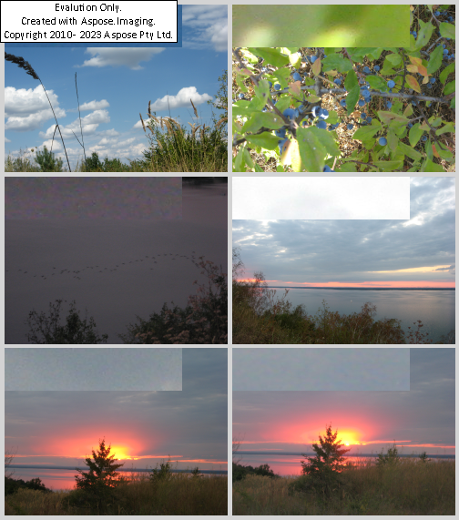
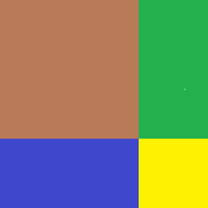

# Aspose.Imaging-Micro-Apps
Aspose.Imaging Micro Applications supply high-level image processing scenarious useful for end-user.

Work over [Aspose.Imaging .NET API] (https://products.aspose.com/imaging/net/).

Following Micro Applications are supported :

## Aspose.Imaging Image merge App 

Allows creation of collage in desired image format from several input images. 

### Competitive features

- Various input and output image formats are supported as per Aspose.[Imaging supported file formats list] (https://docs.aspose.com/imaging/net/supported-file-formats/); 

- Various merge layouts are supported (horizontal, vertical, grid);

- Various image adjustements are supported (to biggest image, to smallest image or without adjustement);

- Resultuing image may be limited by width, height;

- Setting of margin size and background coror are supported;

- ApplicationAspose.Imaging Image merge application may be used via command line or consumed by your C# code via .NET7 compatible API.

### Licensing

Algthough Aspose.Imaging Image merge application is free, Aspose.Imaging .NET is licensed as usually, so you may reuse you reuse your
license via application or evaluate the application using Aspose.Imaging .NET in trial mode. 

### System Requirements
- .NET7 or higher compatible OS;
- Aspose.Imaging Image merge application installed.

### Installation

Please issue the command :

```
dotnet add package Aspose.Imaging Image merge
```

### Usage
Use from command line :

```
dotnet Aspose.Imaging.MicroApps.Merge.dll --input IMG_8472.JPG+IMG_8473.JPG+IMG_8475.JPG+IMG_8476.JPG+IMG_8479.JPG+IMG_8483.JPG --output output.png -background-color lightgray -margin 5 --max-columns 2 --max-rows 3
```

Use from code:

``` csharp
			var options = new ImagingMergeOptions()
			{
				InputImages = "IMG_8472.JPG+IMG_8473.JPG+IMG_8475.JPG+IMG_8476.JPG+IMG_8479.JPG+IMG_8483.JPG".Split("+"),
				ToFormat = "png",
				BackgroundColor = "LightGray",
				Direction = MergeDirection.Horizontal,
				MarginSize = 5,
				AdjustmentType = MergeAdjustmentTypes.Biggest,
				OutputImagePath = "output.png",
				MaxRows = 3,
				MaxColumns = 2
			};

			// You may set path to your Aspose.Imaging .NET license file via parameters
			if (isLicensed)
			{
				options.LicenseFile = "Aspose.Total.Product.Family.lic";
			}

			await MergeTasks.Create(options).Execute();
```

### Examples of output images:






