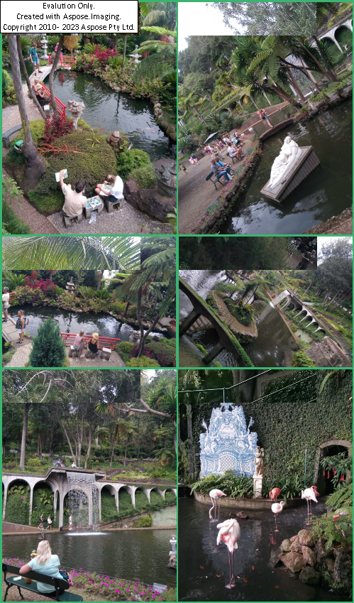

# Aspose.Imaging Micro Apps
Aspose.Imaging Micro Applications supply high-level image processing scenarios useful for end-users.

Work over [Aspose.Imaging .NET API](https://products.aspose.com/imaging/net/).

## Following Micro Applications are supported:

[Aspose.Imaging Image Merge Micro Application](https://products.aspose.app/imaging/image-merge)  

[Aspose.Imaging Image Convert Micro Application](https://products.aspose.app/imaging/image-convert) 

[Aspose.Imaging Image Resize Micro Application](https://products.aspose.app/imaging/image-resize) 

### System Requirements
-.NET7 on Windows, Linux, MacOs;

- Choosen by you Aspose.Imaging Micro application(s) installed.

### Installation

Please issue the command :

```
dotnet tool install --global Aspose.Imaging.Image-Merge
```

If you've already installed the application - update supported via the command :

```
dotnet tool update --global Aspose.Imaging.Image-Merge --version 23.11.2
```

### Usage
**Use from command line:**

``` 
Aspose.Imaging.Image-Merge --input photo_1.jpg+photo_2.jpg+photo_3.jpg+photo_4.jpg+photo_5.jpg+photo_6.jpg --output photo_collage_unlicensed.png --format png --adjustment Biggest --direction Vertical --background-color MediumSeaGreen --margin-size 3 --max-columns 2 --max-rows 3 --max-width 500
```

**Use from code:**

``` csharp
var options = new ImagingMergeOptions()
{
	InputImages = "photo_1.jpg+photo_2.jpg+photo_3.jpg+photo_4.jpg+photo_5.jpg+photo_6.jpg".Split("+"),
	ToFormat = "png",
	BackgroundColor = "MediumSeaGreen",
	Direction = MergeDirection.Vertical,
	MarginSize = 3,
	AdjustmentType = MergeAdjustmentTypes.Biggest,
	OutputImagePath = "photo_collage_licensed.png",
	MaxRows = 3,
	MaxColumns = 2,
    MaxWidth = 500
};

// You may set path to your Aspose.Imaging .NET license file via parameters
if (isLicensed)
{
	options.LicenseFile = "Aspose.Total.Product.Family.lic";
}

await MergeTasks.Create(options).Execute();
```

### Examples of output images:




